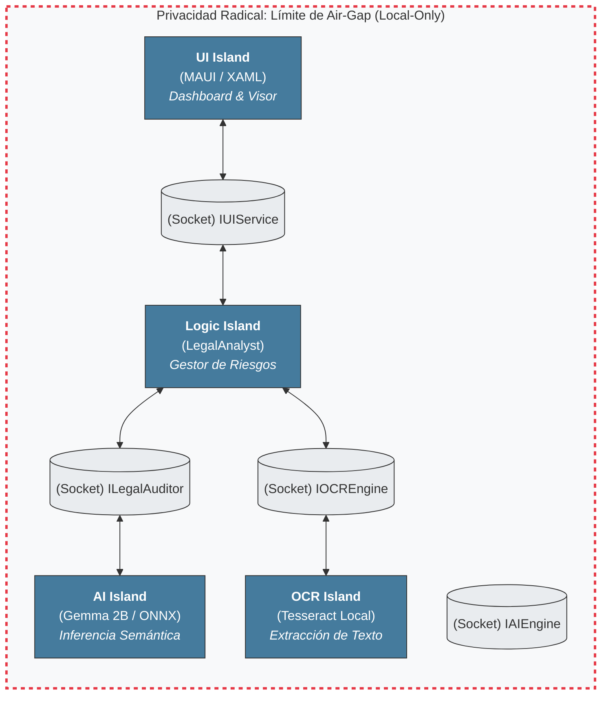

```mermaid
graph TB
    subgraph AirGapBoundary ["Privacidad Radical: Límite de Air-Gap (Local-Only)"]
        direction TB
        
        %% Definición de Islas (Componentes)
        UI_Island["<b>UI Island</b><br/>(MAUI / XAML)<br/><i>Dashboard & Visor</i>"]
        AI_Island["<b>AI Island</b><br/>(Gemma 2B / ONNX)<br/><i>Inferencia Semántica</i>"]
        OCR_Island["<b>OCR Island</b><br/>(Tesseract Local)<br/><i>Extracción de Texto</i>"]
        Logic_Island["<b>Logic Island</b><br/>(LegalAnalyst)<br/><i>Gestor de Riesgos</i>"]

        %% Interfaces (Sockets)
        IUI[("(Socket) IUIService")]
        IAI[("(Socket) IAIEngine")]
        IOCR[("(Socket) IOCREngine")]
        ILogic[("(Socket) ILegalAuditor")]

        %% Conexiones a través de Sockets
        UI_Island <--> IUI
        IUI <--> Logic_Island
        
        Logic_Island <--> ILogic
        ILogic <--> AI_Island
        
        Logic_Island <--> IOCR
        IOCR <--> OCR_Island
    end

    %% Estilos
    style AirGapBoundary fill:#f8f9fa,stroke:#e63946,stroke-width:3px,stroke-dasharray: 5 5
    style UI_Island fill:#457b9d,color:#fff,stroke:#333
    style AI_Island fill:#457b9d,color:#fff,stroke:#333
    style OCR_Island fill:#457b9d,color:#fff,stroke:#333
    style Logic_Island fill:#457b9d,color:#fff,stroke:#333
    
    style IUI fill:#e9ecef,stroke:#333
    style IAI fill:#e9ecef,stroke:#333
    style IOCR fill:#e9ecef,stroke:#333
    style ILogic fill:#e9ecef,stroke:#333
```